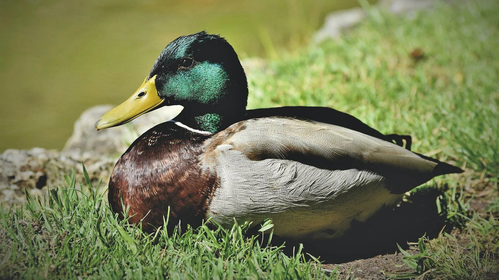

## Images with custom size
```md

```


   
 
### OH MY Duck
hello eee
## Inserting math expressions
**Block type:**
<pre>
<code>
```math
a^2 + b^2
```</code></pre>
or
```html
<katex-display>c = \pm\sqrt{a^2 + b^2}</katex-display>;
```

```math
a^2+b^2\newline
c = \pm\sqrt{a^2 + b^2}
```

**Inline:**

A developer walks into a bar. He orders <katex-inline>\int_0^{\infty}e^{\pi\cdot x^2} dx</katex-inline> beers.
```html
<katex-inline>\int_0^{\infty}e^{\pi\cdot x^2} dx</katex-inline>
```

## Add p5js script
<pre>
<code>
```p5js 
//filename.js

function setup(){
    createCanvas(windowWidth,windowHeight);
}
function draw(){
    background(255,0,0);
}
```
</code>
</pre>


```p5js
// filename.js
function setup(){
    createCanvas(windowWidth,windowHeight);
}
function draw(){
    background(255,0,0);
}
function windowResized(){
    resizeCanvas(windowWidth, windowHeight);
}

let a = `<script>console.log("This works oh yeaahhh")</script>`
document.write(a)
```